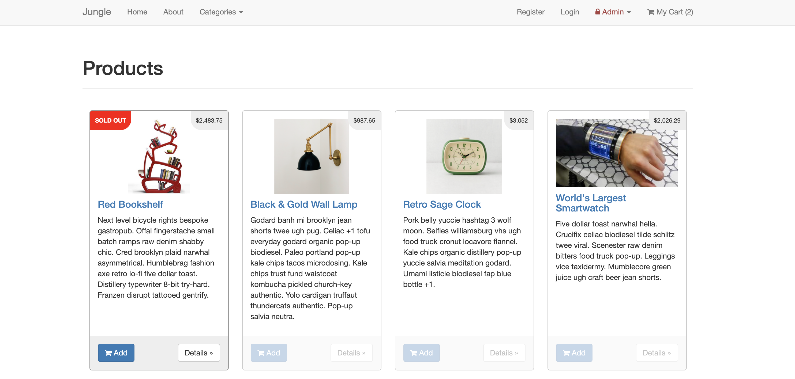
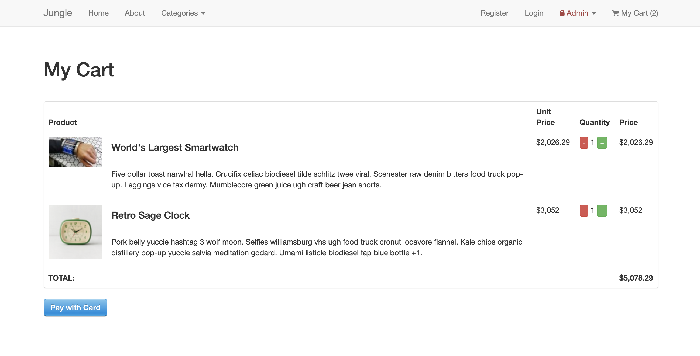
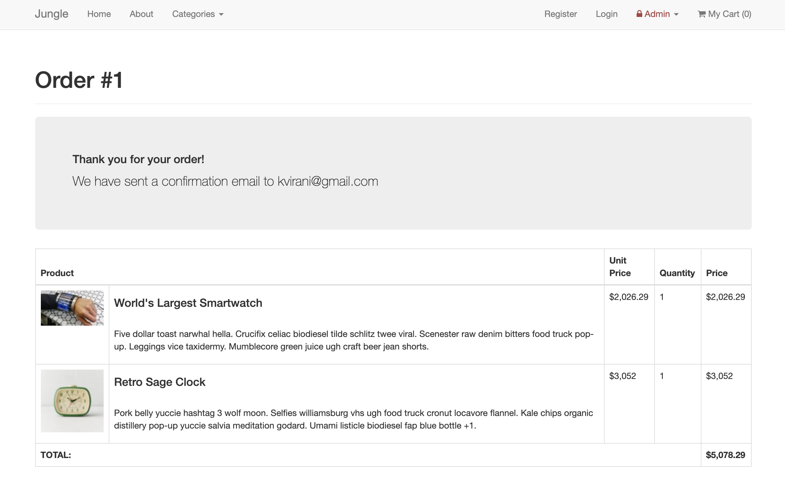
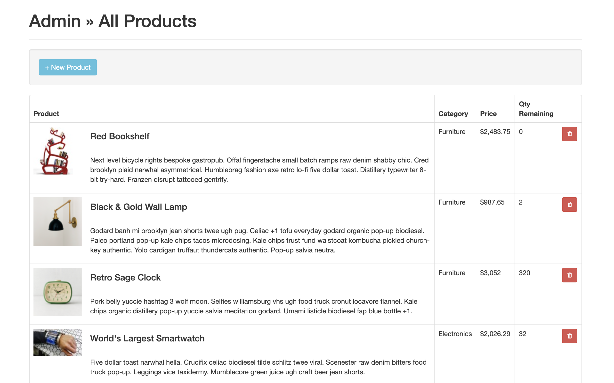
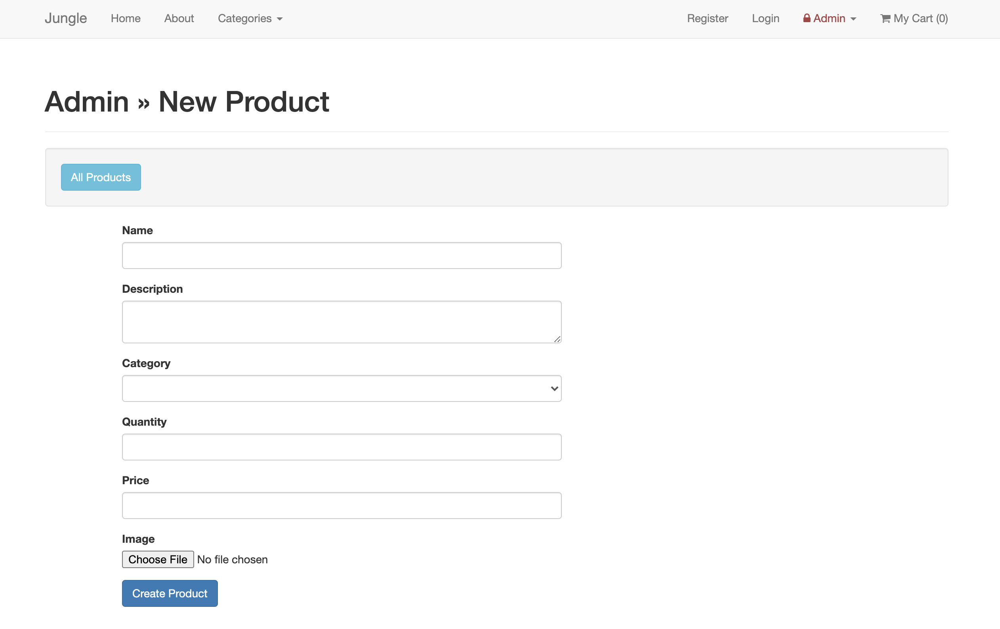

# Jungle

A mini e-commerce application built with Rails 4.2. App tested with RSPEC for models and Capybara(Poltergeist) for features.

## Features 
### Admin
 - Admin users can list and create new categories
 - Admins can add new products using the new category
 - Secured with HTTP basic authentication
 - Dashboard that lists product quantities and categories

### Users

- Add products to cart
- Purchase products (using Stripe)
- Sold out badge when products are out of stock
- Create an account and login

## App Screenshots

Index / Product Page

Cart

Order Confirmation

Admin Products View

Admin Add New Product 

## Setup

1. Run `bundle install` to install dependencies
2. Create `config/database.yml` by copying `config/database.example.yml`
3. Create `config/secrets.yml` by copying `config/secrets.example.yml`
4. Run `bin/rake db:reset` to create, load and seed db
5. Create .env file based on .env.example
6. Sign up for a Stripe account
7. Put Stripe (test) keys into appropriate .env vars
8. Run `bin/rails s -b 0.0.0.0` to start the server

## Stripe Testing

Use Credit Card # 4111 1111 1111 1111 for testing success scenarios.

More information in their docs: <https://stripe.com/docs/testing#cards>

## Dependencies

* Rails 4.2 [Rails Guide](http://guides.rubyonrails.org/v4.2/)
* PostgreSQL 9.x
* Stripe
